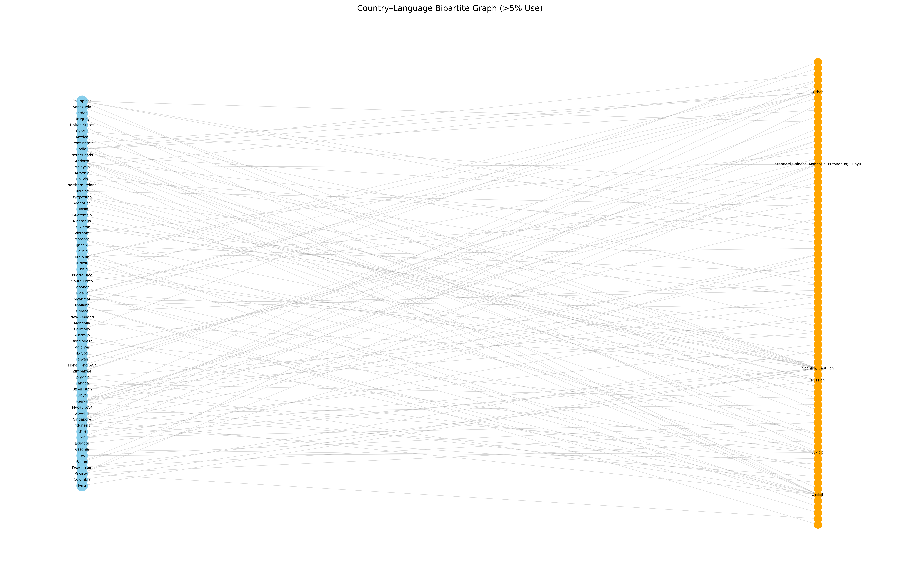
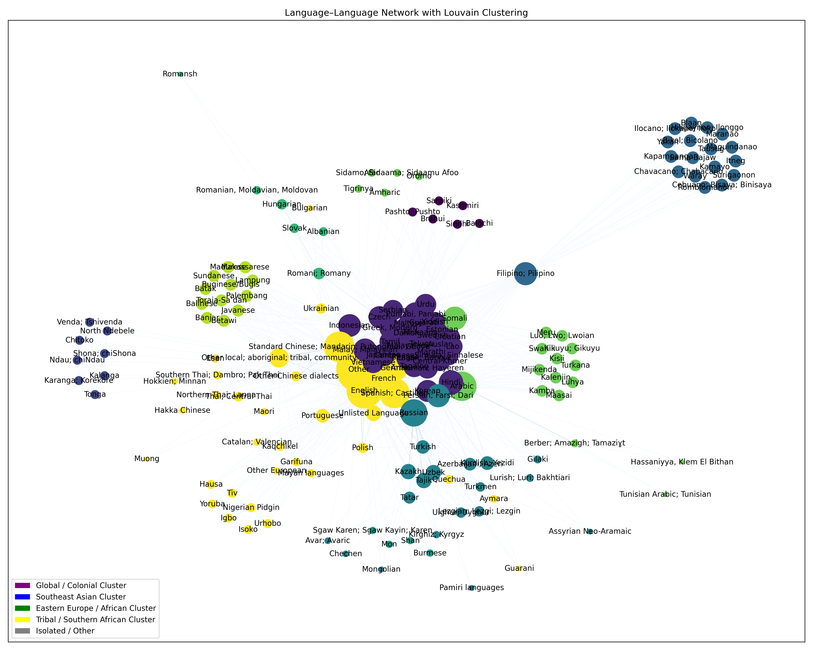
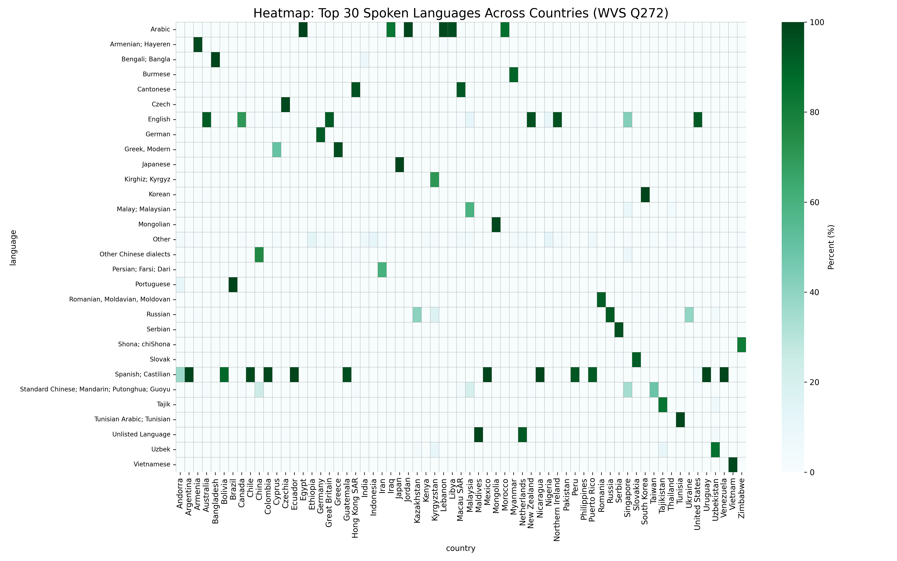

## 🌐 Home Language Network Analysis — World Values Survey


> **Colonial history and migration corridors predict everyday home 
> language use better than linguistic family alone.**

---

## 🌱 About This Project

Part of: **"An Analysis of Worldwide Language Networks and Cultural 
Clustering"** — published at SEET 2025, 2nd Place Best Paper Award.

This repository contains my contribution: full analysis of 
spoken-at-home language data from the World Values Survey (WVS) 
Wave 7, covering 66 countries and 211 language labels.

---

## 🔬 What I Built

- **Bipartite network** connecting 66 countries to 211 languages, 
  weighted by percentage of home speakers
- **Language co-occurrence projection** — languages connected if 
  spoken in the same country
- **Louvain community detection** revealing 5 cultural-linguistic clusters
- **Heatmap** of top 30 languages across all surveyed countries

---

## 📊 Key Results

**Top languages by network degree (weighted):**

| Language | Weighted Degree |
|----------|----------------|
| English | 154.5 |
| Spanish | 137.9 |
| French | 58.9 |
| Russian | 50.7 |
| Arabic | 44.3 |

**5 clusters detected:**
- Global/Colonial cluster — English, Arabic, French, Urdu, Hindi
- Southeast Asian cluster — Javanese, Tagalog, Cebuano
- Eastern European/African cluster — Russian, Ukrainian, Swahili
- Southern African cluster — Tshivenda, Shona, Tonga
- Isolated/peripheral languages

---

## 🖼️ Visualizations

### Country-Language Bipartite Network


### Language Co-occurrence Network (Louvain Clusters)


### Heatmap — Top 30 Languages Across Countries


---

## 🏗️ Project Structure

```
├── scripts/
│   ├── process_q272.py          # Data cleaning and processing
│   ├── home_language_graph.py   # Network construction and analysis
│   └── mapping.py               # Country/language code mapping
├── figures/                     # All visualizations
├── data/                        # WVS data (download separately)
├── results/                     # Generated CSV outputs
└── README.md
```

---

## 🚀 Getting Started

```bash
git clone https://github.com/anhle1122/An-Analysis-of-Worldwide-Language-Networks-Repo-Copy.git
cd An-Analysis-of-Worldwide-Language-Networks-Repo-Copy

python -m venv venv
source venv/bin/activate
pip install -r requirements.txt

# Download WVS data — see data/README.md
python scripts/process_q272.py
python scripts/home_language_graph.py
```

---

## 🛠️ Stack

Python · pandas · NetworkX · Matplotlib · python-louvain

---

## 📄 Paper

**An Analysis of Worldwide Language Networks and Cultural Clustering**  
Fozhan Babaeiyan Ghamsari\*, Anh Le\*, et al.  
*SEET 2025 — 2nd Place Best Paper Award*

---

## 🙏 Acknowledgments

- Dr. Oscar Morales Ponce (CSULB) — project supervisor
- World Values Survey Wave 7 — data source

